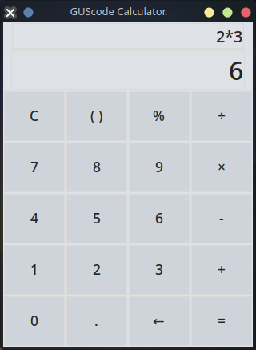

<h1>Calculadora Python</h1>

Aplicación de Calculadora Sencilla, elaborada en lenguaje Python y usando Programación Orientada a Objetos y una interfaz simple en Tkinter.
Proyecto personal para la práctica del lenguaje Python, POO y Tkinter

#### Instalación

Para instalar la calculadora, asegúrate de tener Python 3 instalado en tu sistema. Luego, descarga el archivo `calculator.exe` en el caso de Windows y ejecútalo.

#### Cómo usar la Calculadora Python

Para usar la calculadora, simplemente ingresa los números y las operaciones que deseas realizar en la interfaz. La calculadora puede realizar operaciones básicas como suma, resta, multiplicación, división. También puede calcular porcentajes.

#### Contribuciónes al código

Si deseas contribuir a la aplicación, por favor crea un fork del repositorio y envía tus cambios a través de un pull request. Todas las sugerencias y mejoras son bienvenidas 👍

GUScode

